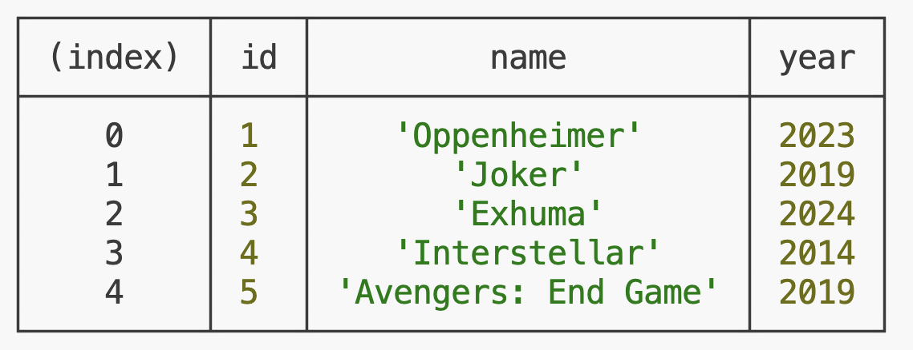

# MOVIE APP [SYNC]

Buatlah sebuah aplikasi bertema `Movie App` via command-line yang mempunyai beberapa fitur yaitu : 
  - help            
  - showMovies      
  - addMovie        
  - deleteMovie     
  
<br>

## Release 0 : Implement `help` command

Buatlah sebuah code yang dimana ketika kita menjalankan perintah `node app.js help` maka akan menampilkan

```shell
$ node app.js help                                            # menampilkan list command yang tersedia
$ node app.js showMovies                                      # menampilkan table data movies yang tersedia 
$ node app.js addMovie <movie_name> <year>                    # menambahkan data movie
$ node app.js deleteMovie <id>                                # menghapus data movie berdasarkan id tertentu
```

<br>

## Release 1 : Implement `showMovies` command

Buatlah sebuah code yang dimana ketika kita menjalankan perintah `node app.js showMovies` maka akan menampilkan data seperti berikut.


<br>

## Release 2 : Implement `addMovie` command

Buatlah sebuah code yang dimana kita bisa menambahkan data movie baru dengan parameter `movie_name` dan `year`.
Pastikan data pada file `movies.json` terupdate.

Contoh : 
```shell
$ node app.js addMovie "Dune Part: 1" 2023

// Output
Movie dengan id 6 bernama "Dune Part: 1" berhasil ditambahkan
```

<br>

## Release 3 : Implement `deleteMovie` command

Buatlah sebuah code yang dimana kita bisa menghapus data movie berdasarkan `id` tertentu.
Pastikan data pada file `movies.json` terupdate.

Contoh: 
```shell
$ node app.js deleteMovie 5

// Output
Movie dengan id 5 berhasil dihapus
```

