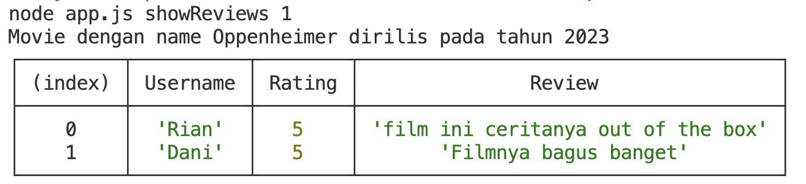
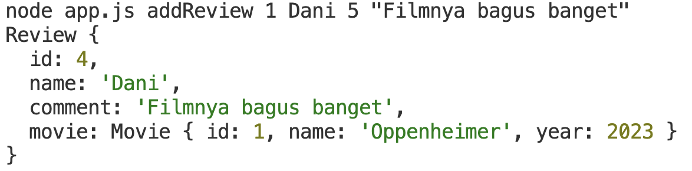

# MOVIE APP PART 2 [ASYNCHRONOUS]

> Pada part ini, akan melanjutkan movie app yang telah dibuat sebelumnya. Pastikan aplikasi pada part sebelumnya sudah berjalan dengan sempurna.

> Sebelum kita menambahkan fitur yang baru, pastikan bahwa setiap model yang kalian buat sudah bersifat `Asynchronous` alias kalian tidak boleh lagi menggunakan ~~fs.readFileSync~~ atau ~~fs.writeFileSync~~. 

> Kalian hanya boleh menggunakan `fs.readFile` atau `fs.writeFile` dalam membaca / memodifikasi sebuah file.

--- 

Pada part ini, kalian akan diminta untuk menambahkan beberapa fitur, yaitu: 
  - addReview
  - showReviews

## Release 0 : Create model `Review`

Buatlah sebuah model bernama `Review` yang memiliki property sebagai berikut:
- id : sebuah nomor unik 
- name : nama user 
- rating : **(private)** rating yang diberikan oleh user 
- comment : comment yang diberikan oleh user
- movie : berupa object movie yang berupa instance dari `Movie`

> Pastikan kalian buat getter dan setter untuk property yang bersifat *private*

## Release 1 : Implement `showReviews` command

Buatlah sebuah code yang dimana kita bisa melihat semua data review berdasarkan `movie_id` tertentu. 

Contoh : ```node app.js showReviews 1```

maka, outputnya menjadi : 


## Release 2 : Implement `addReview` command

Buatlah sebuah code yang dimana kita bisa menambahkan data review baru dengan parameter `movie_id`, `name`, `rating`, dan `comment`.

Pastikan data pada `reviews.json` terupdate dengan **tidak merubah format** yang sudah ada.

Command : `node app.js addReview <movie_id> <name> <rating> <comment>`

Contoh : 
```shell
node app.js addReview 1 Dani 5 "Filmnya bagus banget"
```
maka, outputnya menjadi: 


## Release 3 : Validasi pada `showReviews` command

Buatlah validasi pada `Release 2` bahwa `movie_id` yang dimasukkan sudah pernah direviews oleh user. 

Contoh: 
```shell
> node app.js showReviews 4

// Output
Belum ada review untuk movie dengan nama "Interstellar"
```

## Release 4 : Validasi pada `addReview` command

Buatlah beberapa validasi pada `Release 1`.
- Pastikan `movie_id` yang dikirimkan tersedia pada data `movies.json`. Jika tidak ada, maka berikan pesan `error`. 

Contoh: 
```shell
> node app.js addReview 100 Dani 5 "Filmnya bagus banget"

// Output 
Movie dengan id 100 tidak tersedia
```

- Pastikan rating yang diberikan oleh user berada diantara 1 - 5. Jika diluar range tersebut, maka berikan pesan `error`.

Contoh: 
```shell
> node app.js addReview 1 Dani 10 "Filmnya bagus banget"

// Output
Rating hanya boleh dari angka 1 - 5
```